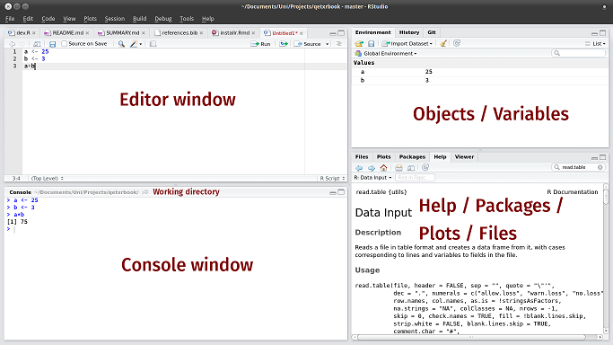

```{r setup, include=FALSE}
library(highcharter)
setwd('G:/Mi unidad/Universidad/Cursos/Curso BICEVIDA')
knitr::opts_chunk$set(fig.path = "static/img/", echo = TRUE, cache = TRUE)

```
# <br><br>Computación Estadística con R<br><small>Clase 1 <br><br> Rubén Soza</small>{ .center .white data-background="#75AADB" }

## Programa del Curso

- Introducción a R: Instalación, Interfaz y Operatoria básica.
- Manipulación de bases de datos en R.
- Análisis exploratorio y descriptivo en R: Estadísticas de Resumen y Visualización. 
- Análisis estadístico en R: Pruebas de hipótesis, regresión y clasificación.
- Creación de reportes utilizando Rmarkdown.
- Otros.

## Clases

- Cada clase consistirá de un 25% de exposición y un 90% de ejercitación.
- **Todos** escribiremos código. *Hechando a prender se aprende!*
- Todo el material estará en la página de [Educación Continua](http://www.educacioncontinua.uc.cl) y en el [GitHub oficial](https://github.com/RubenSoza/Curso-BICEVIDA).

# Introducción a R{ .center .white data-background="#75AADB" }

## Preguntas Frequentes

> <small> The best thing about R is that it was developed by statisticians. The worst thing about R is that ... it was developed by statisticians. </small>

- Un software *libre* para computación estadística y gráficos con cerca de 30 años.
- ¿Por qué? Un software *libre* para computación estadística y gráficos.
- ¿Lo bueno? Un lenguaje simple. Miles de *paquetes* desarrollados por la comunidad. Además es útil para el desarrollo de la academia.
- ¿Lo meh? No es lo más rápido. No posee la mejor [escalabilidad](http://es.wikipedia.org/wiki/Escalabilidad).
- ¿A qué se parece? A otros lenguajes de programación como **python**.

## Descarga e Instalación

- R, el software computacional, se descarga desde el [CRAN](http://cran.r-project.org). Debes elegir la opción que corresponda con tu sistema operativo.
- Rstudio, el panel de control, se descarga desde [Rstudio](http://www.rstudio.com). Elegir la primera opción, "RStudio Desktop Open Source License". 
- Instalar ambos programas de la forma usual.
- Además existe una versión online, [Rstudio Cloud](http://rstudio.cloud)

## Interfaz básica de RStudio



# Primeras Interacciones con R{ .center .white data-background="#75AADB" }

## R como calculadora aritmética

En R se pueden realizar todas las operaciones aritméticas:

```{r}
sqrt(2^4 + exp(3)/55 - log(5*8-2)) 
```

**Nota:** Para correr código desde el editor, utilizar *ctrl + enter*.

## R como calculadora lógica

Además, se pueden realizar operaciones lógicas(&,\|), las cuales retornan como resultado TRUE o FALSE:

```{r}
38 >= 15
3 < 5 & 6 < 5
3 < 5 | 6 < 5 
```

## Objetos básicos de R

En R podemos guardar objetos utilizando las asignación '\<-' o, en su defecto, '='.

```{r}
a <- 20 # Valor numérico
b = 3^2
c <- "Hola Mundo" # String o carácter.
```

Para visualizar un objeto en consola, basta con escribir su nombre en ella, o bien ejecutar la línea deseada desde el editor.
```{r}
a + b
```

## Objetos básicos de R: Funciones

La principal herramienta para trabajar con los diferentes objetos en R son las funciones. Algunos ejemplos son:

- `sum()`
- `mean()`
- `which()`
- `summary()`

**Importante:** Si deseas saber como utilizar una función en específico puedes hacer `?nombre_funcion()`. También puedes buscar [aquí](https://www.google.com).

## Objetos básicos de R: Vectores

Para crear un vector se ocupa la función **c()**. Además podemos crear secuencias con la función **seq()**.
```{r}
x <- c(5,b,7,8,-8,20,7,a)
y <- seq(1,10)
mean(x)
sum(y)
```

## Objetos básicos de R: Vectores
Podemos acceder a un elemento de un vector en una posición específica de un vector utilizando '[]'. Algunos ejemplos:

```{r}
x[3] # Elemento en la posición 3
x[2:4] # Elementos en las posiciones 2 y 4 inclusive
``` 

## Objetos básicos de R: Vectores

```{r}
x[c(5,8)] # Elementos en la posición 5 y 8 
x[-4] # Vector original sin el elemento en la posición 4
```

## Objetos básicos de R: Paquetes

Los paquetes de R son el eje central de su funcionamiento. En cada uno de ellos existen funciones desarrolladas para resolver diferentes tipos de problemáticas. En esta ocasión instalaremos y cargaremos el paquete 'Tidyverse':


## Objetos básicos de R: Paquetes

Para utilizar un paquete en R hay que realizar las siguientes operaciones:

- Instalar el paquete, **install.packages('nombre_paquete').** 
- Cargar el paquete,  **library('nombre_paquete')**.

```{r, message = FALSE}
# install.packages('tidyverse')
library(tidyverse)
```

## Objetos básicos de R: `tibbles`

Corresponden a una forma de guardar bases de datos en `R`. 

```{r}
data <- tibble("Sexo" = c("H","M","H","M"), "Edad" = c(20,18,19,30))
data
```

## Objetos básicos de R: `tibbles`

Puedes acceder a los elementos de un `tibble` utilizando `[,]`

```{r}
data[1,2]
data[1,]
```

## Objetos básicos de R: `tibbles`

```{r}
data[,2]
```

- Además, se puede acceder a una columna específica de la BD utilizando su nombre 

```{r}
data$Sexo
```

## Operador %>% 

Permite realizar composición de funciones. Un ejemplo de su utilización es:

```{r}
x %>% mean() %>% log()
log(mean(x))
```

## Ejemplo en RStudio{ .center .white data-background="#75AADB" }

## Actividad 1

- Genere un vector con los primeros 1000 números impares.
- Del vector anterior, obtenga los impares número 1, 10, 100 y 1000.
- Cálcule la suma de la raíz de los números generados antes utilizando 2 métodos diferentes.

# Importación de Base de Datos{ .center .white data-background="#75AADB" }

## Orígen de la BD

Los datos pueden provenir de muchas fuentes:

- Archivos de texto(txt ó csv)
- Excel(xlsx)
- SPSS(sav)
- SQL(sql)
- STATA(dta)
- Una página web.
- etc.

## Funciones para Importar

Cada fuente tiene su función de importación en tidyverse.

- Si es csv: **read.csv**.
- Si es texto: **read_delim**.
- Si es excel: **read_excel**.
- Si es spss: **read_sav**.

Para más información, pueden entrar al siguiente [torpedo](https://resources.rstudio.com/spanish-pdfs/data-import-cheatsheet-spanish).

## Ejemplo: storms.csv

La base de datos storms se encuentra en el siguiente [link](https://raw.githubusercontent.com/rstudio/EDAWR/master/data-raw/storms.csv).

```{r}
url  <- 'https://raw.githubusercontent.com/rstudio/EDAWR/master/data-raw/storms.csv'
download.file(url, "storms.csv", mode = "wb")

library(readr)
storms <- read.csv('storms.csv', header = T)
storms
```

## Ejemplo: storms.csv

El comando **glimpse()** nos otorga características de las columnas(variables) de la BD.
```{r}
glimpse(storms)
```

## Ejemplo: numeros.xlsx

```{r}
library(readxl)
numeros <- read_excel('Datasets/numeros.xlsx')
numeros
```

## Veamos ahora un ejemplo en RStudio{ .center .white data-background="#75AADB" }

## Actividad 2

- Dirijase a [http://datos.gob.cl](http://datos.gob.cl) y descargue dos bases de datos en diferentes formatos. 
- Lea dichas BD en R y obtenga las características de sus variables. Identifique una variable numérica y una variable categórica.
- Instale el paquete `psych`, carguelo y utilice la función `describe()` de dicho paquete en la variable numérica encontrada antes. Luego, utilice la función `describeBy()` considerando la variable numérica y la categórica.