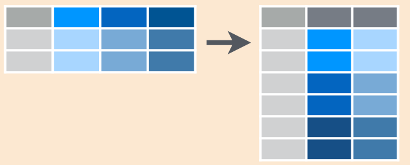
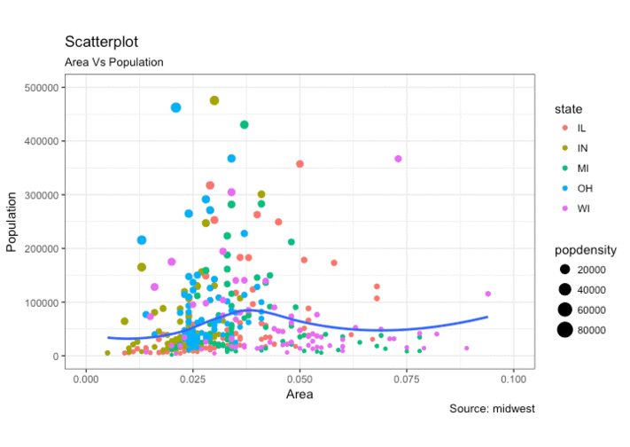

```{r setup, include=FALSE}
library(highcharter)
file.remove(dir("wdgts/", full.names = TRUE))

knitr::opts_chunk$set(fig.path = "static/img/", echo = TRUE, cache = TRUE, message = FALSE)

options(highcharter.theme =
          hc_theme_smpl(chart = list(
            backgroundColor = "transparent",
            style = list(fontFamily = "Source Sans Pro"))
            ))
source("setup.R")

library(readr)
storms <- read.csv('storms.csv', header = T)

```
# <br><br>Computación Estadística con R<br><small>Clase 3 <br><br> Rubén Soza</small>{ .center .white data-background="#75AADB" }


# Manejo de bases de datos utilizando funciones de dplyr{ .center .white data-background="#75AADB" }

## Importar datos

```{r, message = FALSE}
songs <- read_csv("Datasets/songs.csv")
kable(songs)
```

----

```{r}
artists <- read_csv("Datasets/artists.csv")
kable(artists)
```

## Rename: *Renombrar columnas*

Permite cambiar los nombres de las columnas seleccionadas

```{r}
artists %>%
  rename(Nombres = name) -> artist2
kable(artist2)
```

## join: *Juntar bases de datos*

Existen 7 funciones, en dplyr, que permiten juntar/contrastar dos bases de datos en una sola, utilizando una columna como link. Algunos ejemplos son:

- **inner_join()**
- **left_join()**
- **right_join()**

## **left_join**: *Ejemplo*


## Algunos otros ejemplos:

```{r}
artist3 <- inner_join(songs, artists, by = "name")
kable(artist3)
artist4 <- right_join(songs, artists, by = "name")
kable(artist4)
```
----
¿Qué pasa si las columnas links poseen 2 nombres diferentes?

```{r}
left_join(songs,artist2, by = c("name" = "Nombres"))
```

## Veamos un ejemplo en R

## Datos de Tuberculosis

```{r}
library(tidyverse)
data("table4a")
kable(table4a)
```

----

```{r}
data("table2")
kable(table2)
```

----

```{r}
cases <- read_csv("Datasets/cases.csv")
kable(cases)
```

¿Como obtendríamos el promedio por país?

## ¿Como obtendríamos el promedio por país?

```{r}
cases %>% 
  mutate(promedio = (`2011` + `2012` + `2013`)/3) -> Promedios
kable(Promedios)
```

Ahora pensemos en una tabla más grande, con más años.. 

## gather: *Recolectar*

Coloca nombres de columnas en una variable (columna) __key__, recolectando los 
valores (__value__) de las columnas en un __sola__ columna



## gather: *Código*

```{r}
table4ag <- gather(table4a, `1999`, `2000`, key = "year", value = "cases")
kable(table4ag)
```

## spread: *Esparcir*

Esparce un par de columnas (2, key-value) en multiples columnas 


## spread: *Código*

```{r}
table2s <- spread(table2, type, count)
kable(table2s)
```

## Veamos un ejemplo en R{ .center .white data-background="#75AADB" }

# Análisis exploratorio y descriptivo en R{ .center .white data-background="#75AADB" }

## Estructura

- ¿Por que?
- Definiciones 
- Recomendaciones Técnicas & Visuales
- Ejercicios y concursos

## ¿Por que visualización?


<!-- https://twitter.com/sdbernard/status/946701218298126341  -->

## Definición técnica (Posible)

Representación gráfica de datos __codificando la información__ como: posición, tamaño, formas, colores


----

Muchos sabores:



----

Cosas importantes sobre visualización de datos:

- Lleva información, es un mensaje
- Ejercicio mental para interpretar o _decodificar_(!!) información
- No siempre es el fin
- Herramienta exploratoria
- Distintas visualizaciones en mismos datos / Distintas historias

----

```{r, echo = FALSE}
data(gapminder, package = "gapminder")

gapminder %>% 
  distinct(country, continent) %>% 
  count(continent) %>% 
  ggplot() +
  geom_col(aes(continent, n, fill = continent), width = 0.5) + 
  scale_fill_viridis_d(guide = FALSE) +
  labs(
    title = "Africa tiene más países que el resto de continentes",
    subtitle = "Un interesante subtitulo para contexto y dar detalles quizás puede ser\nmás largo pero quien soy yo para decir que se debe y lo que no",
    caption = "Importante mencionar la fuente, en caso contrario no me creen",
    x = "Contienentes",
    y = "Países"
    ) + 
  theme(plot.subtitle = element_text(size = 9))
```

----

```{r, echo = FALSE}
gapminder %>% 
  group_by(country) %>% 
  filter(row_number() == n()) %>% 
  ungroup() %>% 
  ggplot() + 
  geom_point(aes(lifeExp, gdpPercap, size = pop, color = continent), alpha = 0.7) +
  scale_color_viridis_d(option = "A") + 
  scale_y_sqrt(name = "GDP per Capita", labels = comma, limits = c(NA, NA)) +
  scale_x_continuous(name = "Esperanza de vida", labels = comma, limits = c(NA, NA)) +
  scale_size(labels = comma, range = c(3, 10), breaks = c(100, 1000, 2000)*1e6) +
  labs(title = "Esperanza de vida y GDP per capita ")
```

----

```{r, echo = FALSE}
data(legosets , package = "lego")
ggplot(legosets) + 
  geom_point(aes(Pieces, USD_MSRP, size = Minifigures, color = Year), alpha = 0.7) +
  scale_color_viridis_c(option = "A") + 
  scale_y_sqrt(name = "Precio USD", labels = dollar, limits = c(0, 300)) +
  scale_x_sqrt(name = "Piezas", labels = comma, limits = c(0, 2000)) +
  labs(title = "Precios según piezas")
```

----

```{r, echo = FALSE}
legosets %>% 
  mutate(year2 = floor(Year/10)*10) %>% 
  select(year2, Year, everything()) %>% 
  ggplot() +
  geom_jitter(aes(factor(year2), USD_MSRP, size = Pieces, color = Year), alpha = 0.5, width = 0.25) +
  scale_color_viridis_c(option = "A") + 
  scale_y_continuous(name = "Precio USD", labels = dollar, limits = c(0, 300)) + 
  scale_x_discrete(name = "Década") +
  labs(title = "Precios/Década")
```

----

```{r, eval=FALSE, results='hide', echo = FALSE}
# install.packages(c("rgexf", "ggnetwork", "intergraph"))
# 316
library(tidyverse)
library(viridis)
library(igraph)
library(rgexf)
library(stringr)
library(ggnetwork)
library(ggrepel)

net <- "http://media.moviegalaxies.com/gexf/92.gexf" %>% 
  read_lines() %>% 
  read.gexf() %>% 
  gexf.to.igraph()

V(net)$name <- str_to_title(V(net)$name)
V(net)$label <- V(net)$name %>% 
  str_extract_all("^\\w{2}| \\w") %>% 
  map_chr(function(x) {
    x %>% unlist() %>% str_c(collapse = "")
  })
V(net)$size <- page.rank(net)$vector
cl <- cluster_fast_greedy(net)
V(net)$comm <- membership(cl)

f <- colorRamp(viridis::inferno(10))
c <- (V(net)$comm/max(V(net)$comm)) %>% f() %>% {./255} %>% rgb()
V(net)$color <- c

# head(ggnetwork(net))
set.seed(123)
ggnet <- ggnetwork(net)
dfnet2 <- ggnet %>%
  as.matrix() %>%
  as.data.frame() %>%
  tbl_df() %>%
  select(x, y, vertex.names, weight, size) %>%
  mutate_all(as.character) %>%
  mutate_at(vars(x, y, weight, size), as.numeric) %>%
  filter(is.na(weight))

ggplot(ggnet) + 
  geom_edges(aes(x, y, size = width, color = factor(comm),
           xend = xend, yend = yend), color = "gray", size = 1, alpha = 0.4) +
  geom_point(aes(x, y, size = size, color = factor(comm))) +
  geom_text_repel(aes(x, y, label = vertex.names, size = size),
                  data = dfnet2, color = "#666666",
                  family = "Roboto Condensed") +
  scale_color_viridis(discrete = TRUE) + 
  theme_blank() +
  labs(size = "Importancia", color = "Grupo")
```

## Ejercicio

¿Existe el mejor gráfico? ¿Cuál de las siguientes formas funciona mejor con el títutlo?

__La región del sur exhibe el mayor crecimiento__

<br>
<small>
Adapatado del tweet de [Lisa Charlotte Rost](https://twitter.com/lisacrost/status/948233069110222848)
que a su vez está viene del ejemplo del libro "Show me the numbers" de Stephen Few
</small>
</span>

----

Los datos:

```{r, echo = FALSE}
library(readxl)
data1 <- read_excel("Datasets/numeros.xlsx") %>% 
  mutate(region = factor(region, levels = c("sur", "norte", "este", "oeste")))
titulo <- "La región del sur exhibe el mayor crecimiento"
data1 %>% 
  spread(cuarto, valor) %>% 
  arrange(region) %>% 
  knitr::kable()
```

----

Opción #1

```{r, echo = FALSE}
p1 <- ggplot(data1) +
  geom_col(aes(cuarto, valor, group = region, fill = region),
           color = "gray80", position = "dodge") +
  scale_fill_viridis_d(option = "B", end = 0.90)
p1 + labs(title = titulo)
```

----

Opción #2

```{r, echo = FALSE}
p2 <- ggplot(data1) +
  geom_col(aes(region, valor, group = cuarto, fill = region),
           color = "gray80", position = "dodge") +
  scale_fill_viridis_d(option = "B", end = 0.90)
p2 + labs(title = titulo)
```

----

```{r, echo = FALSE}
p3 <- data1 %>% 
  mutate(ind = as.numeric(region == "sur")) %>%
  ggplot() +
  geom_line(aes(cuarto, valor, group = region, alpha = ind, color = region), size = 2.5) +
  scale_y_continuous(limits = c(0, NA)) + 
  scale_alpha(range = c(0.5, 1), guide = FALSE) +
  scale_color_viridis_d(option = "B", end = 0.90)
p3 + labs(title = titulo)
```

----

<br>

```{r, fig.width=12, echo = FALSE}
gridExtra::grid.arrange(
  p1 + theme(axis.text.y = element_blank(), legend.position="none"),
  p2 + theme(axis.text.y = element_blank(), legend.position="none"),
  p3 + theme(axis.text.y = element_blank(), legend.position="none"),
  nrow = 1)
```

----

(Posible) Respuesta

__No. Dependerá de tu mensaje, de tu historia.__


# Visualizando con ggplot2  { .center .white data-background="#75AADB" }

## ggplot2

Características:

- Paquete para visualizar datos mediante capas
- Es muy poderoso y flexible
- Se carga junto al `tidyverse`
- No es la única opción en R para graficar

## Datos

```{r}
theme_set(theme_gray())
```

```{r, echo=TRUE}
library(gapminder)
data(gapminder)
paises <- gapminder %>% 
  filter(year == max(year))
paises
```

## Creando un gráfico :)

```{r, echo=TRUE,  fig.height = 4}
ggplot(data = paises)
```

## Mejorando un gráfico

```{r, echo=TRUE,  fig.height = 4}
ggplot(data = paises) + 
  geom_point(mapping = aes(x = lifeExp, y = gdpPercap))
```

## Que sucedió?

```r
ggplot(data = paises) + 
  geom_point(mapping = aes(x = lifeExp, y = gdpPercap))
```

<small>

- `ggplot()` crea un sistema de coordenadas al cual se pueden agregar capas
- `ggplot(data = paises)` da un grafico vacío pues no agregamos capas
- `geom_point()` agrega una capa de puntos al gráfico usando las filas de `paises`
- Cada función `geom_algo` tiene un argumento de mapping que define cómo se asignan o se “mapean” las variables del conjunto de datos a propiedades visuales del `geom_algo`
-  El argumento de mapping siempre aparece emparejado con `aes()`, y los argumentos `x` e `y` especifican qué variables asignar a los ejes `x` e `y`

</small>

----

Podemos setear  las propiedades estéticas de tu geom manualmente:

```{r, echo=TRUE,  fig.height = 4}
ggplot(data = paises) + 
  geom_point(mapping = aes(x = lifeExp, y = gdpPercap), color = "blue")
```

---- 

En este caso un punto no solo puede poseer x e y, puede tener tamaño dado
por una variable

```{r, echo=TRUE,  fig.height = 4}
ggplot(data = paises) + 
  geom_point(mapping = aes(x = lifeExp, y = gdpPercap, size = pop), color = "blue")
```

---- 

Quizás en lugar de setear color fijo, podemos asignarlo segun una variable

```{r, echo=TRUE,  fig.height = 4}
ggplot(data = paises) + 
  geom_point(mapping = aes(x = lifeExp, y = gdpPercap, size = pop, color = continent))
```

---- 

O realizar _facets_/paneles

```{r, echo=TRUE,  fig.height = 4}
ggplot(data = paises) + 
  geom_point(mapping = aes(x = lifeExp, y = gdpPercap, size = pop)) +
  facet_wrap(vars(continent))
```

## Paquete Útil: `GGTHEMEASSIST`

Para editar algunas características de los gráficos, se puede utilizar el adicional proveniente del paquete `ggThemeAssist`. Para ello:

- Instalar el paquete.
- Seleccionar el código **completo** que genera el gráfico.
- Hacer click en Addins > ggplot Theme Assistant.
- Editar todo lo deseado.

## Gráficos en la misma ventana: `Rmisc`

Generamos 3 gráficos diferentes:

```{r, echo=TRUE,  fig.height = 4}
Ang <- gapminder %>% 
  filter(country == 'Angola')

p1<- ggplot(data = Ang) + 
  geom_line(mapping = aes(x = year, y = gdpPercap))+
  ggtitle("gdpPercap")
p2<- ggplot(data = Ang) + 
  geom_line(mapping = aes(x = year, y = lifeExp))+
  ggtitle("lifeExp")
p3<- ggplot(data = Ang) + 
  geom_line(mapping = aes(x = year, y = pop))+
  ggtitle("pop")
```

----

```{r}
library(Rmisc)
multiplot(p1, p2, p3, cols=1)

```

----

Ahora poniéndolo todo junto:
  
```{r, echo=TRUE,  fig.height = 4}

ggplot(data = Ang) + 
  geom_line(mapping = aes(x = year, y = scale(gdpPercap),colour = "gdpPercap"))+
  geom_line(mapping = aes(x = year, y = scale(lifeExp),colour = "lifeExp"))+
  geom_line(mapping = aes(x = year, y = scale(pop),colour = "pop"))+
  ylab('')

```

## Existen muchos tipos de gráficos disponibles en `ggplot2`. Veamos algunos ejemplos en R!{ .center .white data-background="#75AADB" }

## Responda las preguntas de la Actividad-Clase-3.pdf{ .center .white data-background="#75AADB" }
